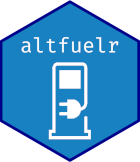

<!-- README.md is generated from README.Rmd. Please edit that file -->

```{r, include = FALSE}
knitr::opts_chunk$set(
  collapse = TRUE,
  comment = "#>",
  fig.path = "man/figures/README-",
  out.width = "100%"
)
```

# altfuelr   
<!-- badges: start -->
[](https://travis-ci.com/burch-cm/altfuelr)
<!-- badges: end -->

The goal of altfuelr is to provide an R-friendly interface to the National Renewable 
Energy Laboratory (NREL) alternative fuel location tools. The NREL Alternative Fuels 
Data Center provides resources to locate fueling stations around the US and Canada 
by fuel type. These tools are used by DOT constituent agencies to determine the best location for new vehicles, and can be used outside of government reporting for trip planning, planning a new vehicle purchase, or helping determine the cost of living in an area.

The altfuelr package contains the NREL AFDC alternate fuel data set, and provides R-friendly API interfaces to get information from the updated API instantly.

## API Keys  
NREL requires an API key to query any of their tools. You can request an API key here: [NREL Developer API Requests](https://developer.nrel.gov/docs/api-key/).


## Installation  

<!-- You can install the released version of altfuelr from [CRAN](https://CRAN.R-project.org) with: -->

<!-- ``` r -->
<!-- install.packages("altfuelr") -->
<!-- ``` -->

Altfuelr has been submitted to CRAN, but has not yet been approved. If you want to use altfuelr yourself, you can install the development version from [GitHub](https://github.com/burch-cm/altfuelr) with:

``` r
# install.packages("devtools")
devtools::install_github("burch-cm/altfuelr")
```
## Examples  


### Counting Alternative Fuel Stations  

The All-Stations API endpoint provides information on fuel stations around the US and Canada. As an example, to find information on ethanol fueling stations in North Carolina, we can access the NREL API with the following:

```{r tesla-example}
library(altfuelr)
library(dplyr)
my_api_key <- Sys.getenv("NREL_API")

# Set your parameters
# ethanol = E85
nc_params <- nrel_params(state = "NC", 
                         status = "E",
                         limit = "all")

nc_stations <- all_stations(api_key = my_api_key, params = nc_params)

# To get a count of stations by type:
stations(nc_stations) %>%
    group_by(fuel_type_code) %>%
    count()
```
The count_stations() helper function can pull out additional information, such as the number of electric charging outlets, in addition to the number of stations:

```{r}
count_results(nc_stations)
```


### Fleet Planning  

Altfuelr was designed to be used in automated fleet planning tools. As an example, FAA National HQ receives a request to purchase a vehicle in Jackson Hole, Wyoming. By Federal law, they need to purchase alternative fuel vehicles when feasible, so should they purchase a petroleum or alternative fuel vehicle for this request?

Each agency is different, but let's say the FAA will purchase an alternate fuel vehicle (AFV) if there are at least one station with alternative fuels in a 5-mile radius from the vehicle's garaged location.  

```{r radius-example}
veh_address <- "447 Snow King Avenue, Jackson WY"

# radius is supplied in miles
jh_params <- nrel_params(radius = 5)

jh_stations <- nearest_stations(my_api_key, location = veh_address, jh_params)

# Count stations by type
stations(jh_stations) %>%
    group_by(fuel_type_code) %>%
    count()
```

In this case, there are quite a few electric stations, one propane stations, and one liquefied natural gas station near the address. This would be a good candidate for an alternative fuel vehicle.

Another method can quickly answer this question:
```{r station-nearby}
alt_fuel_near(my_api_key, veh_address)
```

And if we wanted to be more specific:
```{r E85-nearby}
alt_fuel_near(my_api_key, veh_address, fuel_type = "E85")
```

This can be applied to a list of locations with {purrr} to allow for programmatic determination of alternate fuel vehicle suitability. We need to pass the API Key as a closure so that the only free variable is the location:

```{r list-nearby}
locs <- list("Raleigh, NC",
             "Nome, AK",
             "Cordova, AK",
             "800 Independence Ave SW Washington, DC")

alt_fuel_keyed <- function(location) {
    alt_fuel_near(my_api_key, location = location, miles = 5)
}

purrr::map_lgl(locs, alt_fuel_keyed)
```
